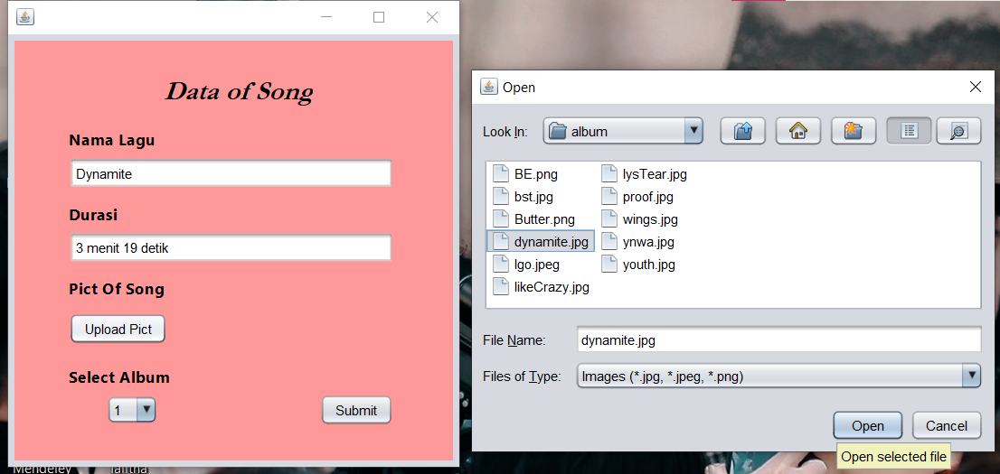

## Janji
Saya Talitha Syahla NIM 2101330 mengerjakan Soal TP2
dalam mata kuliah Desain Pemrograman Berorientasi Objek untuk keberkahanNya 
maka saya tidak melakukan kecurangan seperti yang telah dispesifikasikan. Aamiin.

# TUGAS PRAKTIKUM 2 DPBO 2023
Buatlah program Java yang terkoneksi dengan database MySQL. Berikut spesifikasi program yang harus dibuat:
    - Program bebas, kecuali program Mahasiswa dan Book Author
    - Terdapat proses Create, Read, Update, dan Delete data
    - Terdapat proses Autentikasi (Login, Register) *
    - Menggunakan minimal 2 tabel pada database
    - Harus terdapat minimal 1 properti gambar pada class yang dibuat (gambar akan ditampilkan pada UI)
    - Terdapat pergantian screen pada UI
    - Terdapat button navigasi untuk beralih screen
    - List data ditampilkan menggunakan card (JPanel)

File README ini berisikan design program, penjelasan alur program, dan dokumentasi saat program dirun/dijalankan.

# Design 

## Design Database

Database yang digunakan pada program ini ada 3 tabel, yaitu tabel login, tabel album, dan tabel lagu. Album dan lagu memiliki relasi `one to manny`, dimana satu album memiliki banyak lagu di dalamnya. Relasi tersebut dihubungkan oleh _foreign key_ pada tabel lagu yaitu `id_album` yang tertuju pada tabel album yaitu `id_album`.  

## Design Program

Design pada program disini menggunakan 7 Class, yaitu:

1) `Class Login`, Class ini merupakan JFrame yang akan menjadi tampilan paling pertama jika program dijalankan. JFrame ini berfungsi untuk menampilkan form login kepada user. User akan diminta memasukkan _username_ dan _password_ yang sesuai dengan database, jika tidak maka login gagal dilakukkan.

2) Class JPanelCard, Class ini merupakan JFrame yang menjadi halaman utama pada program ini. JFrame ini akan menampilkan data-data berupa data album dan data lagu. Terdapat JScrollPane yang digunakan untuk menampung Card-Card yang berisikan data album dan data lagu. Pada JFrame ini juga terdapat button yang berfungsi untuk mengubah tampilan data, misalnya jika menekan button `Song List` maka data yang akan ditampilan adalah data lagu, begitupun sebaliknya. Selain itu, terdapat button yang berfungsi untuk menambahkan data, misalnya jika menekan button `Add Album` maka program akan menampilkan form untuk menambahkan data album (tambahData/tambahData2) begitupun sebaliknya.

3) Class dbConnection, Class ini berfungsi untuk menghubungkan frame-frame program ke database. Method yang terdapat pada class ini akan digunakan untuk memproses query.

4) Class Card, Class ini merupakan JPanel yang berfungsi untuk menampilkan `data Album`. Pada JPanel ini terdapat button edit yang dapat digunakan untuk mengubah data album dan button delete yang dapat digunakan untuk menghapus data album.

5) Class Card2, Class ini merupakan JPanel yang berfungsi untuk menampilkan `data Lagu`. Pada JPanel ini terdapat button edit yang dapat digunakan untuk mengubah data lagu dan button delete yang dapat digunakan untuk menghapus data lagu.

6) Class tambahData, Class ini merupakan JPanel yang berfungsi sebagai form inserData dan updateData untuk `data Album`. Pada inserData dan upateData ini user dapat menambahkan dan mengupdate data berupa nama_album, tahun_rilis, dan dapat mengupload gambar dari album tersebut. Terdapat juga button `Submit` yang dapat ditekan oleh user jika sudah mengisikan data-data tersebut. Nantinya data akan secara otomatis masuk ke database.

7) Class tambahData2, Class ini merupakan JPanel yang berfungsi sebagai form inserData dan updateData untuk `data Lagu`. Pada inserData dan upateData ini user dapat menambahkan dan mengupdate data berupa nama_lagu, durasi, memilih lagu yang akan diadd atau diedit tersebut terdapat pada album yang mana dan dapat mengupload gambar dari lagu tersebut. Terdapat juga button `Submit` yang dapat ditekan oleh user jika sudah mengisikan data-data tersebut. Nantinya data akan secara otomatis masuk ke database.

# Alur Program
1. Program akan menampilkan form login. User dapat memasukkan _username_ dan _password_ pada textfield yang telah disediakan, lalu dapat menekan tombol `Login`.

2. Jika login berhasil, maka program akan menampilkan JPanelCard yang secara default akan menampilkan data Album. Terdapat button `Add Album`, user dapat menekan tombol tersebut jika ingin menambahkan data Album. Terdapat juga button `Song List`, yang mana jika user menekan tombol ini, JPanelCard yang tadinya menampilkan data Album secara default akan terganti dengan JPanelCard yang menampilkan data Lagu. 

3. Jika user menekan tombol `Add Album`, program akan menampilkan form yang dapat digunakan untuk menambahkan data Album. Jika data sudah diisi, dapat menekan tombol `Submit` lalu akan menampilkan JPanelCard dengan tampilan Card Album dengan data baru yang telah di add. Lalu terdapat tombol `edit` dan `delete` pada Card Album yang ditampilkan. 

4. Jika user menekan tombol `edit` maka program akan menampilkan form untuk mengubah data Album tersebut. Jika user menekan tombol `delete` maka program akan menampilkan pop up berupa confirm kepada user, jika user memilih `yes` maka data berhasil didelete.

5. Jika user menekan tombol `Song List`, program akan menampilkan JPanelCard yang menampilkan data Lagu. Terdapat tombol `Add Song`, jika user menekan tombol tersebut maka program akan menampilkan form yang dapat digunakan untuk menambahkan data Lagu.
Jika data sudah diisi, dapat menekan tombol `Submit` lalu akan menampilkan JPanelCard dengan tampilan Card Lagu dengan data baru yang telah di add. Lalu terdapat tombol `edit` dan `delete` pada Card Lagu yang ditampilkan. 

6. Jika user menekan tombol `edit` maka program akan menampilkan form untuk mengubah data Lagu tersebut. Jika user menekan tombol `delete` maka program akan menampilkan pop up berupa confirm kepada user, jika user memilih `yes` maka data berhasil didelete.

`Akun Login`
    - `Username` : admin
    - `Password` : pjm

# Dokumentasi

    - Form Login

    - JPanelCard (Card1 -> Data Album)

    - Form Add Data Album

    - Form Edit Data Album

    - Delete Data Album

    - JPanelCard (Card2 -> Data Lagu)

    - Form Add Data Lagu

    - Form Edit Data Lagu

    - Delete Data Lagu
